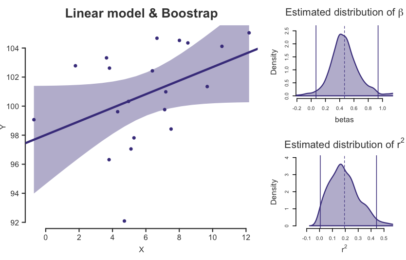

# R-Boostrap-for-a-linear-model  
R code for a panel of a linear regression model with the density plots of the estimated statistics.  
The confidence intervals of 95% are showed as a shaded area in the linear regression and as vertical lines in the density plot.  
  
1.  `lm_boost.R`, the R code file.  
2.  `lm_boostrap.png`, a png example of the resultant plot.  

