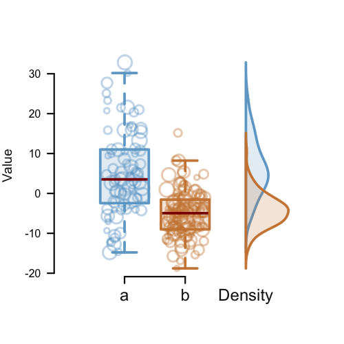

# R-Boxplot-with-points-Density  
R code for a box plot with jitter points and a density plot.  
1.  `box.Dens.R`, the code file.  
2.  `Rplot-box-pts.png`, an image of the graph.  
  
For more R graphs check this [gallery](http://www.r-graph-gallery.com).
