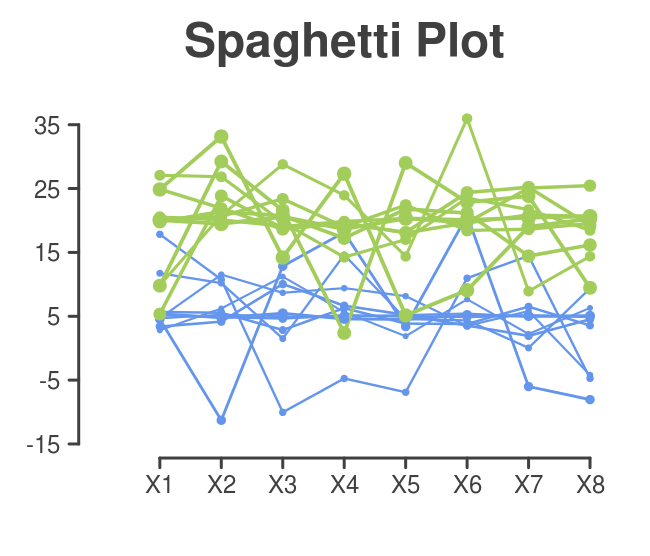

# R-Custom plots
Inside each folder you'll find scripts for three different types of graphs done with R. You can find a README file, a png of the output and the R code.  
The graphs are the next:  
> **Linear model plot**: with confidence interval and boostrap statistics.  
> **Boxplot with density**: A modified boxplot with each point graphed and the ensity histogram.  
> **Lines plot**: or spaguetti plot where x values are the variables that describes the same object.  
> **Heatmap**: comming soon!
  
| Lineal Model & Bootstrap  | Boxplot with Density | Lines plot  |
| ------------- | ------------- | ------------- |
|   |   |   |

  
For more R graphs check this [gallery](http://www.r-graph-gallery.com).  
  
  
  
## Boxplot with density and points  
  

